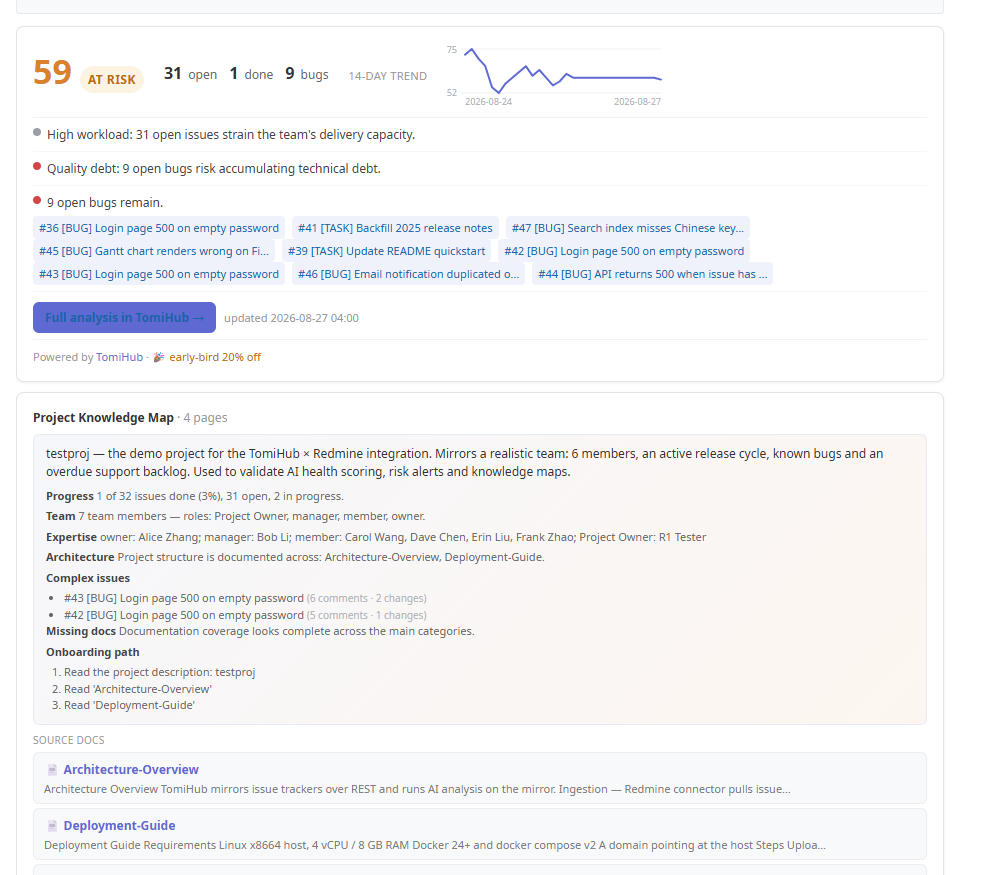

# TomiHub AI Co-pilot for Redmine

AI-powered project health badge and knowledge map for Redmine, backed by a
self-hosted [TomiHub](https://tomatovector.com) instance on the same LAN.

**Your Redmine stays unchanged.** The plugin is a read-only window — TomiHub
mirrors your project over the REST API and runs the AI analysis on its side.
The badge is free; full analysis (risk breakdowns, agent, team health) lives
in the TomiHub UI.



## What you get

On every project overview page:

- **Health score + level** (healthy / at risk / critical)
- **14-day trend sparkline**
- **Top risks** with colored category dots and clickable links to the
  Redmine issues they reference
- **Project knowledge map** — AI-generated overview (summary, team,
  onboarding path) plus your mirrored wiki pages with content snippets
- **Stats** — open / done / bugs

Languages: English, 中文, 日本語.

## How it works

```
Redmine (this plugin) ──X-Api-Key──▶ TomiHub API
                                      ├─ REST mirror of your Redmine (issues,
                                      │  wiki, changelogs)
                                      └─ AI analysis (health, risks,
                                         knowledge map) on the mirror
```

- The plugin only talks to TomiHub. No AI traffic, no data leaves your
  network beyond what you already expose to TomiHub.
- Analysis results are cached for 60 s; the knowledge map for 5 min.
- If TomiHub is unreachable, the card degrades to a setup hint — it never
  breaks the project page.

## Get TomiHub

The badge needs a TomiHub instance to talk to. Apply for the free 14-day
self-hosted trial at <https://tomatovector.com/tomihub> — we email you the
download link and a trial license. **Early birds applying before Oct 31, 2026
get 20% off their first year.**

## Installation

```sh
cd /path/to/redmine/plugins
git clone https://github.com/tomatovector/redmine_tomihub.git redmine_tomihub
cd ..
bundle install        # no new gems — the client uses net/http only
bundle exec rake redmine:plugins:migrate RAILS_ENV=production
# restart Redmine
```

Compatible with **Redmine 7.0+** (tested on 7.0.0; uses the
`view_projects_show_left` hook and Zeitwerk-safe requires).

## Configuration

Administration → **TomiHub**, or Administration → Plugins → **Configure**:

| Field | Description |
|-------|-------------|
| TomiHub URL | Base address of your self-hosted TomiHub instance, reachable **from this Redmine server** (e.g. `http://10.0.0.8:8080`) |
| TomiHub API Key | Key created in TomiHub with the `redmine-readonly` scope (read-only — the plugin never writes) |
| Redmine API Key | An admin API key of **this** Redmine (Administration → API). Used by TomiHub to mirror your data over REST. LAN-only — never expose it publicly |
| Project identifiers | Comma-separated Redmine project identifiers to sync (used by "Sync now") |

Then use **Test connection** and **Sync now**, and wait for TomiHub to run
its first analysis. Open any project to see the health card.

## Troubleshooting

- **"TomiHub unreachable"** — the URL must be reachable *from the Redmine
  server*, not from your browser. The card is rendered server-side.
- **"No analysis data"** — sync the project and wait for the AI analysis
  to finish (see the TomiHub UI).
- **401 Unauthorized** — check the TomiHub API key scope: it must include
  `redmine-readonly`.

## License

GPL-2.0-or-later — see [LICENSE](LICENSE).

## About TomiHub

TomiHub is a self-hosted AI project-management co-pilot: it mirrors your
issue tracker, builds a knowledge graph, and gives you health scores, risk
alerts and an AI agent over your real project data. This plugin is the free
on-ramp — the badge in Redmine, the full analysis in TomiHub.
